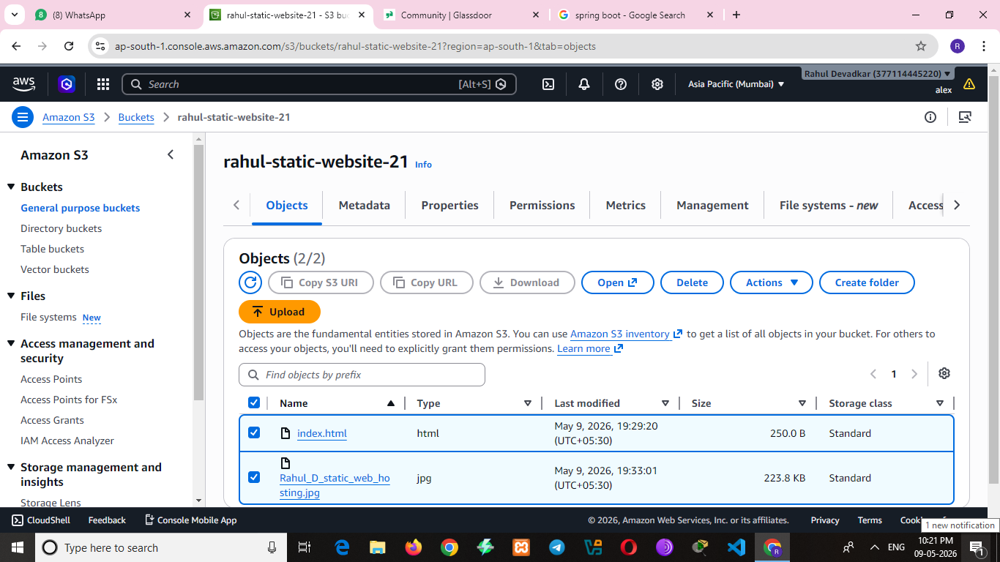
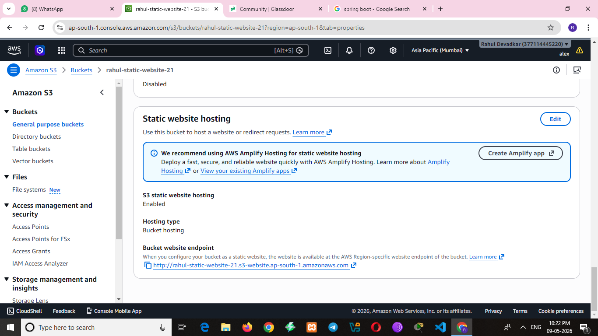
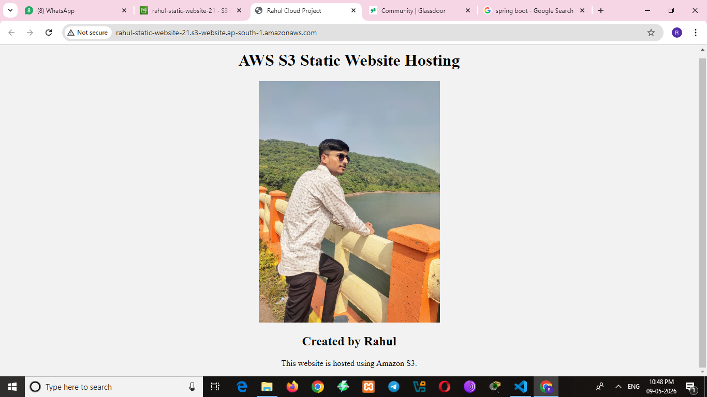

# AWS S3 Static Website Hosting

## Project Overview
This project demonstrates static website hosting using Amazon S3.

## Technologies Used
- AWS S3
- HTML
- GitHub

## Features
- Static website hosting
- Public object access
- Cloud-based storage

## Project Screenshots

### S3 Bucket

### Static Website Hosting

### Website Output

## Author
Rahul Devadkar